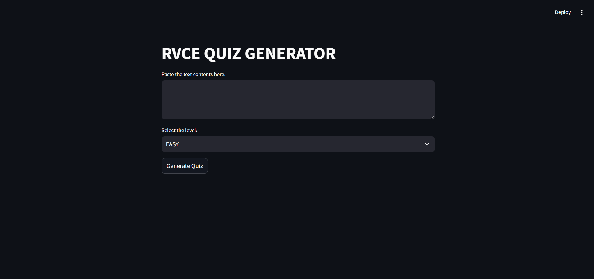

# Quiz Generator

## Overview

Quiz Generator is a Streamlit application that generates multiple-choice quizzes based on provided text content. Users can select the difficulty level of the quiz and get a set of multiple-choice questions that conform to the provided text. The application leverages the OpenAI API to generate questions dynamically.

## Features

- Generate multiple-choice questions from provided text.
- Choose quiz difficulty level (EASY, MEDIUM, HARD).
- View and submit answers to the generated quiz.
- Display quiz results with correct answers.

## Screenshots

### Home Page




## Requirements

- Python 3.x
- Streamlit
- OpenAI API

## Setup

1. **Clone the Repository:**
   ```bash
   git clone https://github.com/amiteshsrinivas/Quiz-Generator.git

2.  **Navigate to the Project Directory:**
   ```bash
   cd Quiz-Generator

3. **Set Up a Virtual Environment:**
      - **Create a virtual environment (if not already created):**
         ```bash
         python -m venv quiz_env

      - **Activate the virtual environment:**
         - **For Windows PowerShell:**
         ```powershell
         .\quiz_env\Scripts\Activate.ps1

         - **For Windows Command Prompt:**
         ```cmd
         .\quiz_env\Scripts\activate

         - **For macOS/Linux:**
         ```bash
         source quiz_env/bin/activate

4.  **Install Dependencies:**
   ```bash
   pip install -r requirements.txt

5. **Set Up Environment Variables:**
      - Create a .env file in the root directory of the project.
      - **Add your OpenAI API key to the .env file:**
      ```makefile
      OPENAI_API_KEY=your_openai_api_key

6. **Run the Application:**
   ```bash
   streamlit run quizapp.py


```arduino

Including these instructions ensures that users know how to set up and activate their virtual environment before running your application.


